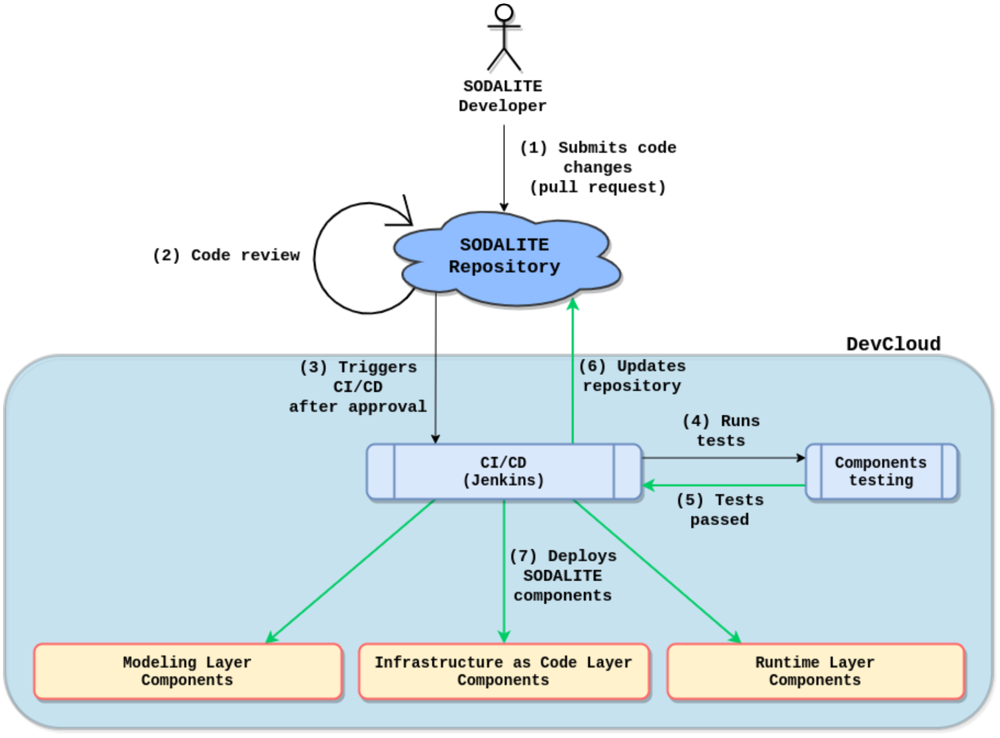

# SODALITE - SOftware Defined AppLication Infrastructures managemenT and Engineering: Guidelines for Contributors

**Table of Contents**
- [1. Introduction](#1-Introduction)
- [2. SODALITE Architecture and the geography of the SODALITE open source repositories](#2-sodalite-architecture-and-the-geography-of-the-sodalite-open-source-repositories)
  - [2.1. The SODALITE Modeling Layer](#21-the-sodalite-modeling-layer)
  - [2.2. The SODALITE Infrastructure as a Code Layer](#22-the-sodalite-infrastructure-as-a-code-layer)
  - [2.3. The SODALITE Runtime Layer](#23-the-sodalite-runtime-layer)
  - [2.4. The SODALITE Security Pillar](#24-the-sodalite-security-pillar)
- [3. General organization of repositories](#3-general-organization-of-repositories)
- [4. Licenses](#4-licenses)
- [5. Roles and Responsibilities](#5-roles-and-responsibilities)
- [6. SODALITE development flow](#6-sodalite-development-flow)
- [7. Guidelines for external contributors](#7-guidelines-for-external-contributors)
- [8. Guidelines for software and release management](#8-guidelines-for-software-and-release-management)
- [9. Code Quality of Repositories](#9-code-quality-of-repositories)
- [10. Conclusions](#10-conclusions)
- [11. References](#11-references)

<!---->

	
 


**Acknowledgement**

The work described here has been conducted within the Research & Innovation action SODALITE (project no. 825480), started in February 2019, and co-funded by the European Commission under the Information and Communication Technologies (ICT) theme of the H2020 framework programme (H2020-ICT-16-2018: Software Technologies)


# 1. Introduction

This document presents the structure of the SODALITE organization on GitHub ([https://github.com/SODALITE-EU](https://github.com/SODALITE-EU)) and the open source repositories adopted for the development of the SODALITE components. Moreover, it introduces external contributors to the rules and steps to be followed to participate in the SODALITE effort. We are seeking contributions at various levels, ranging from using the offered tools to highlighting bugs and extension possibilities to contributing to the code of a specific component. This is an important element of the SODALITE documentation and will be evolved based on the development of the project. 

# 2. SODALITE Architecture and the geography of the SODALITE open source repositories

The SODALITE platform is roughly organized in three layers (see Figure 1): Modeling Layer, Infrastructure as Code Layer, and Runtime Layer.  Each layer is further decomposed into a number of different elements. Such decomposition has been initially defined in Deliverable D2.1 [3] and the updated version in Deliverable D2.2 [4]. It is evolving based on the current understanding gathered by all project partners.   

The SODALITE software and team is organized around these three layers and is made available to external contributors through GitHub (github.com). In particular, we have created the SODALITE-EU organization ([https://github.com/SODALITE-EU](https://github.com/SODALITE-EU)) which, at the time of writing, features three teams of committers, one for each layer of the architecture, and various repositories, one for each subcomponent or group of strictly interrelated subcomponents. The organization also maintains an additional repository which includes the overall documentation of the project. In the following subsections we provide a short overview of the various layers of the SODALITE architecture, we identify the components that are part of each layer and the corresponding repositories.  


<!---->

	

Figure 1. SODALITE high level architecture (from D2.2)


## 2.1. The SODALITE Modeling Layer

The Modeling Layer offers the tools to support all modeling activities by the SODALITE users. Its elements are the IDE offering smart editing features enhanced with suggestions that are generated, in a context-based fashion,  by the Semantic Reasoner. The latter component is reasoning on an extensible ontology, the Semantic Knowledge Base, that includes the main concepts needed to model a deployment configuration for a complex application. The following table lists these three components together with the main technologies they are based on and the GitHub repositories that include their code.

Table 1. Components of the Modeling Layer and corresponding repositories


<table>
  <tr>
   <td><strong>Component</strong>
   </td>
   <td><strong>Main used technologies</strong>
   </td>
   <td><strong>GitHub repository</strong>
   </td>
  </tr>
  <tr>
   <td><strong>SODALITE IDE</strong>: The development environment offered to users. It supports modeling using the SODALITE Domain Specific Language (DSL)
<p>
<strong>License</strong>: Apache2
   </td>
   <td><strong>Programming language(s): </strong>Java, Xtend
<p>
<strong>DBMS technology: </strong>Eclipse workspace (filesystem)
<p>
<strong>Middleware: </strong>Spring IO
<p>
<strong>UI/UX technology: </strong>Eclipse, REST API, Orchestrator, Keycloak<strong> </strong>
   </td>
   <td><a href="https://github.com/SODALITE-EU/ide">https://github.com/SODALITE-EU/ide</a>
   </td>
  </tr>
  <tr>
   <td><strong>Semantic Reasoner (Knowledge Base Service - KBS)</strong>: The component supporting semantic reasoning over the knowledge base
<p>
<strong>License</strong>: Apache2
   </td>
   <td><strong>Programming language(s): </strong>Java
<p>
<strong>DBMS technology: </strong>RDF triple store (GraphDB)
<p>
<strong>Middleware: </strong>Apache Tomcat
<p>
<strong>UI/UX technology: </strong>REST API
   </td>
   <td><a href="https://github.com/SODALITE-EU/semantic-reasoner">https://github.com/SODALITE-EU/semantic-reasoner</a>
   </td>
  </tr>
  <tr>
   <td><strong>Semantic Knowledge Base (KB)</strong>: The ontology that describes the main concepts needed to model an application deployment
<p>
<strong>License</strong>: Apache2
   </td>
   <td><strong>Programming language(s): </strong>RDF/OWL 2
<p>
<strong>DBMS technology: </strong>RDF triple store (GraphDB)
<p>
<strong>Middleware: </strong>N/A
<p>
<strong>UI/UX technology: </strong>N/A
   </td>
   <td><a href="https://github.com/SODALITE-EU/semantic-models">https://github.com/SODALITE-EU/semantic-models</a>
   </td>
  </tr>
</table>


## 2.2. The SODALITE Infrastructure as a Code Layer

The Infrastructure as a Code Layer is in charge of transforming an Abstract Deployment Model built using the modeling layer into an executable blueprint and a set of related artifacts (configuration scripts and execution container images). It also includes tools that identify and detect anti-patterns to be avoided as well as mechanisms to optimize the deployment of an application based on its characteristics. More specifically, this layer includes the subcomponents described in the following table. 

Table 2. Components of the Infrastructure as a Code Layer and corresponding repositories


<table>
  <tr>
   <td><strong>Component</strong>
   </td>
   <td><strong>Main used technologies</strong>
   </td>
   <td><strong>GitHub repository</strong>
   </td>
  </tr>
  <tr>
   <td><strong>Abstract Model Parser</strong>: It parses an abstract deployment model and generates the corresponding abstract syntax tree
<p>
<strong>License</strong>: Apache2
   </td>
   <td><strong>Programming language(s): </strong>Python
<p>
<strong>DBMS technology: </strong>N/A
<p>
<strong>Middleware: </strong>Docker
<p>
<strong>UI/UX technology: </strong>REST API
   </td>
   <td><a href="https://github.com/SODALITE-EU/iac-blueprint-builder">https://github.com/SODALITE-EU/iac-blueprint-builder</a>
   </td>
  </tr>
  <tr>
   <td><strong>IaC Blueprint Builder</strong>: Starting from the output provided by the Abstract Model Parser, this generates a TOSCA blueprint
<p>
<strong>License</strong>: Apache2
   </td>
   <td><strong>Programming language(s): </strong>Python
<p>
<strong>DBMS technology: </strong>N/A
<p>
<strong>Middleware: </strong>Docker
<p>
<strong>UI/UX technology: </strong>REST API
   </td>
   <td><a href="https://github.com/SODALITE-EU/iac-blueprint-builder">https://github.com/SODALITE-EU/iac-blueprint-builder</a>
   </td>
  </tr>
  <tr>
   <td><strong>IaC Model Repository</strong>: It is a part of the Knowledge Base, that gives the performance model or optimization for a given application/node type. 
<p>
<strong>License</strong>: Apache2
   </td>
   <td><strong>Programming language(s): </strong> Python
<p>
<strong>DBMS technology: </strong>MySQL
<p>
<strong>Middleware: </strong>N/A
<p>
<strong>UI/UX technology: </strong>N/A
   </td>
   <td><a href=" https://github.com/SODALITE-EU/application-optimisation"> https://github.com/SODALITE-EU/application-optimisation.</a>
   </td>
  </tr>
  <tr>
   <td><strong>Runtime Image Builder</strong>: It generates application component images ready to be executed 
<p>
<strong>License</strong>: Apache2
   </td>
   <td><strong>Programming language(s): </strong>Python, Ansible
<p>
<strong>DBMS technology: </strong>SQLite
<p>
<strong>Middleware: </strong>xOpera,<strong> </strong>Docker, Singularity
<p>
<strong>UI/UX technology: </strong>REST API
   </td>
   <td><a href="https://github.com/SODALITE-EU/image-builder">https://github.com/SODALITE-EU/image-builder</a>
   </td>
  </tr>
  <tr>
   <td><strong>Concrete Image Builder</strong>: Concrete Image Builder builds the image adjusting it to the execution platform and handles specific implementation regarding configuration, deployment or monitoring
<p>
<strong>License</strong>: Apache2
   </td>
   <td><strong>Programming language(s): </strong>Python, Ansible
<p>
<strong>DBMS technology: </strong>N/A
<p>
<strong>Middleware: </strong>xOpera,<strong> </strong>Docker, Singularity, Kompose
<p>
<strong>UI/UX technology: </strong>REST API, HPC container
   </td>
   <td><a href="https://github.com/SODALITE-EU/image-builder">https://github.com/SODALITE-EU/image-builder</a>
   </td>
  </tr>
  <tr>
   <td><strong>Application Optimiser - MODAK</strong>: Tries to build a performance-wise improved version of an application for a given target platform based on the optimisation options selected
<p>
<strong>License</strong>: Apache2
   </td>
   <td><strong>Programming language(s): </strong>Python, Ruby, CRESTA Autotuning
<p>
<strong>DBMS technology: </strong>N/A
<p>
<strong>Middleware: </strong>Dockerhost engine, Singularity engine
<p>
<strong>UI/UX technology: </strong>REST API
   </td>
   <td><a href="https://github.com/SODALITE-EU/application-optimisation">https://github.com/SODALITE-EU/application-optimisation</a>
   </td>
  </tr>
  <tr>
   <td><strong>IaC Verifier</strong>: Acts as a facade to the Topology Verifier and Provisioning Workflow Verifier, and coordinates the processes of verification of the application deployment topology and provisioning workflow
<p>
<strong>License</strong>: Apache2
   </td>
   <td><strong>Programming language(s): </strong>Java, Python 
<p>
<strong>DBMS technology: </strong>N/A
<p>
<strong>Middleware: </strong>Web Server 
<p>
<strong>UI/UX technology: </strong>Swagger REST API
   </td>
   <td><a href="https://github.com/SODALITE-EU/verification">https://github.com/SODALITE-EU/verification</a>
   </td>
  </tr>
  <tr>
   <td><strong>Verification Model Builder</strong>: This component builds the models required to verify the deployment model and its provisioning workflow
<p>
<strong>License</strong>: Apache2
   </td>
   <td><strong>Programming language(s): </strong>Java and Python
<p>
<strong>DBMS technology: </strong>RDF triple store (GraphDB)
<p>
<strong>Middleware: </strong>RDF triple store (GraphDB)
<p>
<strong>UI/UX technology: </strong>N/A
   </td>
   <td><a href="https://github.com/SODALITE-EU/verification">https://github.com/SODALITE-EU/verification</a>
   </td>
  </tr>
  <tr>
   <td><strong>Topology Verifier</strong>: This component verifies the constraints over the structures of the TOSCA blueprints and Ansible playbooks
<p>
<strong>License</strong>: Apache2
   </td>
   <td><strong>Programming language(s): </strong>Java and Python
<p>
<strong>DBMS technology: </strong>N/A
<p>
<strong>Middleware: </strong>N/A
<p>
<strong>UI/UX technology: </strong>N/A
   </td>
   <td><a href="https://github.com/SODALITE-EU/verification">https://github.com/SODALITE-EU/verification</a>
   </td>
  </tr>
  <tr>
   <td><strong>Provisioning Workflow Verifier</strong>: It verifies the constraints over the deployment (provisioning) workflow of the application using one of the widely used techniques for verifying workflows such as Petri Net
<p>
<strong>License</strong>: Apache2
   </td>
   <td><strong>Programming language(s): </strong>Java and Python
<p>
<strong>DBMS technology: </strong>N/A
<p>
<strong>Middleware: </strong>CPN Tools
<p>
<strong>UI/UX technology: </strong>N/A
   </td>
   <td><a href="https://github.com/SODALITE-EU/verification">https://github.com/SODALITE-EU/verification</a>
   </td>
  </tr>
  <tr>
   <td><strong>Bug Predictor and Fixer</strong>: It detects smells in TOSCA and Ansible playbooks and suggests corrections or fixes for each smell
<p>
<strong>License</strong>: Apache2
   </td>
   <td><strong>Programming language(s): </strong>Java and Python
<p>
<strong>DBMS technology: </strong>N/A
<p>
<strong>Middleware: </strong>Web Server
<p>
<strong>UI/UX technology: </strong>Swagger REST API
   </td>
   <td><a href="https://github.com/SODALITE-EU/defect-prediction">https://github.com/SODALITE-EU/defect-prediction</a>
   </td>
  </tr>
  <tr>
   <td><strong>Predictive Model Builder</strong>: This component uses a rule-based model for detecting implementation and security smells in Ansible playbooks and TOSCA blueprints
<p>
<strong>License</strong>: Apache2
   </td>
   <td><strong>Programming language(s): </strong>Java and Python
<p>
<strong>DBMS technology: </strong>RDF triple store (GraphDB)
<p>
<strong>Middleware: </strong>RDF triple store (GraphDB)
<p>
<strong>UI/UX technology: </strong>N/A
   </td>
   <td><a href="https://github.com/SODALITE-EU/defect-prediction">https://github.com/SODALITE-EU/defect-prediction</a>
   </td>
  </tr>
  <tr>
   <td><strong>IaC Quality Assessor</strong>: it includes the tool to calculate the software quality metrics for TOSCA and Ansible artifacts
<p>
<strong>License</strong>: Apache2
   </td>
   <td><strong>Programming language(s): </strong>Java and Python
<p>
<strong>DBMS technology: </strong>N/A
<p>
<strong>Middleware: </strong>N/A
<p>
<strong>UI/UX technology: </strong>N/A
   </td>
   <td><a href="https://github.com/SODALITE-EU/iac-quality-framework">https://github.com/SODALITE-EU/iac-quality-framework</a>
   </td>
  </tr>
   <tr>
   <td><strong>Platform Discovery Service</strong>: It creates a TOSCA platform resource model definition based on access data and type provided by the Resource Expert.
<p>
<strong>License</strong>: Apache2
   </td>
   <td><strong>Programming language(s): </strong>Python, TOSCA, Ansible
<p>
<strong>DBMS technology: </strong>N/A
<p>
<strong>Middleware: </strong>Dockerhost engine
<p>
<strong>UI/UX technology: </strong>API
   </td>
   <td><a href="https://github.com/SODALITE-EU/platform-discovery-service">https://github.com/SODALITE-EU/platform-discovery-service</a>
   </td>
  </tr>
  <tr>
   <td><strong>Image Registry</strong>: It stores the images after their generation by the Runtime and Concrete Image Builder
<p>
<strong>License</strong>: Apache2
   </td>
   <td><strong>Programming language(s): </strong>Python, Ansible
<p>
<strong>DBMS technology: </strong>N/A
<p>
<strong>Middleware: </strong>Dockerhost engine
<p>
<strong>UI/UX technology: </strong>N/A
   </td>
   <td><a href="https://github.com/SODALITE-EU/iac-management">https://github.com/SODALITE-EU/iac-management</a>
   </td>
  </tr>
  <tr>
   <td><strong>Examples of IaC code and images</strong>: This is not a software component, but rather a set of IaC code examples that are developed to provide examples to the users of the SODALITE platform
<p>
<strong>License</strong>: Apache2
   </td>
   <td><strong>Programming language(s): </strong>TOSCA, Ansible
<p>
<strong>DBMS technology: </strong>N/A
<p>
<strong>Middleware: </strong>Dockerhost engine
<p>
<strong>UI/UX technology: </strong>N/A
   </td>
   <td><a href="https://github.com/SODALITE-EU/iac-management">https://github.com/SODALITE-EU/iac-management</a>
   </td>
  </tr>
</table>


## 2.3. The SODALITE Runtime Layer

The Runtime Layer is in charge of orchestrating, monitoring and reconfiguring the execution of a complex application even when it exploits multiple execution environments (Cloud, HPC, GPUs). The following table describes each sub-component of this layer and links to the corresponding GitHub repository. Most of the sub-components highlighted here extend and/or integrate pre-existing open source components. These are included as submodules in the corresponding repositories.  

Table 3. Components of the Runtime Layer and corresponding repositories


<table>
  <tr>
   <td><strong>Component</strong>
   </td>
   <td><strong>Main used technologies</strong>
   </td>
   <td><strong>GitHub repository</strong>
   </td>
  </tr>
  <tr>
   <td><strong>Orchestrator -> xOpera</strong>: This is a pre-existing lightweight TOSCA compliant orchestrator that executes infrastructure provisioning and deployment of applications and blueprints produced in  SODALITE. 
<p>
<strong>License</strong>: Apache2
   </td>
   <td><strong>Programming language(s): </strong>TOSCA, Ansible, Python
<p>
<strong>DBMS technology: </strong>N/A
<p>
<strong>Middleware: </strong>OpenStack<strong> </strong>
<p>
<strong>UI/UX technology: </strong>REST API 
   </td>
   <td><a href="https://github.com/SODALITE-EU/orchestrator">https://github.com/SODALITE-EU/orchestrator</a>  
<p>
includes the following repository as submodule
<p>
<a href="https://github.com/xlab-si/xopera-opera">https://github.com/xlab-si/xopera-opera</a> 
   </td>
  </tr>
  <tr>
   <td><strong>Orchestrator -> ALDE</strong>: This component includes the drivers that enable the usage of xOpera within SODALITE.
<p>
<strong>License</strong>: Apache2
   </td>
   <td><strong>Programming language(s): </strong>Python
<p>
<strong>DBMS technology: </strong>SQLite
<p>
<strong>Middleware: </strong>Flask
<p>
<strong>UI/UX technology: </strong>REST API
   </td>
   <td><a href="https://github.com/SODALITE-EU/orchestrator">https://github.com/SODALITE-EU/orchestrator</a>
   </td>
  </tr>
  <tr>
   <td><strong>xOpera REST API</strong> - includes xOpera REST API interface with persistence, TOSCA blueprint registration session management, status and history of deployment, documented with swagger
   </td>
   <td><strong>Programming language(s): </strong> Python, Ansible
<p>
<strong>DBMS technology: </strong> Postgres
<p>
<strong>Middleware: </strong> Kubernetes, OpenStack, HPC
<p>
<strong>UI/UX technology: </strong> REST API, AWS
   </td>
   <td><a href="https://github.com/SODALITE-EU/xopera-rest-api">https://github.com/SODALITE-EU/xopera-rest-api</a>
   </td>
  </tr>
  <tr>
   <td><strong>Monitoring -> IPMI Exporter</strong>: This includes custom exporter files that enable to get the power consumption of physical nodes
<p>
<strong>License</strong>: Apache2
   </td>
   <td><strong>Programming language(s): </strong>Go
<p>
<strong>DBMS technology: </strong>ElasticSearch, OrientDB
<p>
<strong>Middleware:</strong> Prometheus, Grafana, Skydive
<p>
<strong>UI/UX technology:</strong> REST API, WebUI
   </td>
   <td><a href="https://github.com/SODALITE-EU/ipmi-exporter">https://github.com/SODALITE-EU/ipmi-exporter</a>
   </td>
  </tr>
  <tr>
   <td><strong>Monitoring -> Skydive Exporter</strong>: The Skydive Flow Exporter is a pre-existing tool that provides a framework for building pipelines which extract flows from the Skydive Analyzer (via it WebSocket API), process them and send the results upstream. 
<p>
<strong>License</strong>: Apache2
   </td>
   <td><strong>Programming language(s): </strong>Go
<p>
<strong>DBMS technology: </strong>ElasticSearch, OrientDB
<p>
<strong>Middleware: </strong>Prometheus, Grafana, Skydive
<p>
<strong>UI/UX technology: </strong>REST API, WebUI
   </td>
   <td><a href="https://github.com/SODALITE-EU/monitoring-system">https://github.com/SODALITE-EU/monitoring-system</a>
<p>
includes the following repository as submodule: 
<p>
<a href="https://github.com/skydive-project/skydive-flow-exporter">https://github.com/skydive-project/skydive-flow-exporter</a>
   </td>
  </tr>
  <tr>
   <td><strong>Monitoring configuration files</strong>: This includes configuration files used for the current Prometheus deployment
<p>
<strong>License</strong>: Apache2
   </td>
   <td><strong>Programming language(s): </strong>TOSCA, Ansible, Prometheus configuration files (YAML)
<p>
<strong>Middleware: </strong>Prometheus, Grafana, Skydive
   </td>
   <td><a href="https://github.com/SODALITE-EU/monitoring-system">https://github.com/SODALITE-EU/monitoring-system</a>
   </td>
  </tr>
  <tr>
   <td><strong>LRE Exporter</strong>: It will be a Prometheus exporter that will provide monitoring metrics at the level of the Light-weight Runtime Environment (LRE).
<p>
<strong>License</strong>: Apache2
   </td>
   <td><strong>Programming language(s): </strong>Go
<p>
<strong>Middleware:</strong> Prometheus
<p>
<strong>UI/UX technology:</strong> REST API
   </td>
   <td><a href="https://github.com/SODALITE-EU/monitoring-lre-agent">https://github.com/SODALITE-EU/monitoring-lre-agent</a>
   </td>
  </tr>
  <tr>
   <td><strong>HPC Exporter</strong>: It will be a Prometheus that will provide monitoring metrics of the execution of applications on an HPC environment.
<p>
<strong>License</strong>: Apache2
   </td>
   <td><strong>Programming language(s): </strong>Go
<p>
<strong>Middleware:</strong> Prometheus
<p>
<strong>UI/UX technology:</strong> REST API
   </td>
   <td><a href="https://github.com/SODALITE-EU/hpc-exporter">https://github.com/SODALITE-EU/hpc-exporter</a>
   </td>
  </tr>
  <tr>
   <td><strong>Deployment Refactorer</strong>: Includes rule-based and machine-learning based approaches to refactoring the deployment model of an application at runtime
<p>
<strong>License</strong>: Apache2
   </td>
   <td><strong>Programming language(s): </strong>Java<strong>, </strong>MySQL, Redis, Python
<p>
<strong>Middleware: </strong>Web Server, Rule Engine, Redis, Varnish
<p>
<strong>UI/UX technology: </strong>Swagger REST API
   </td>
   <td><a href="https://github.com/SODALITE-EU/refactoring-ml">https://github.com/SODALITE-EU/refactoring-ml</a>
   </td>
  </tr>
  <tr>
   <td><strong>Node Manager</strong>: Includes control-theory based approaches to managing the resources in the nodes in a deployment model
<p>
<strong>License</strong>: Apache2
   </td>
   <td><strong>Programming language(s): </strong>Python
<p>
<strong>DBMS technology: </strong>N/A
<p>
<strong>Middleware: </strong>TensorFlow, Spark, Kubernetes
<p>
<strong>UI/UX technology: </strong>N/A
   </td>
   <td><a href="https://github.com/SODALITE-EU/refactoring-ct">https://github.com/SODALITE-EU/refactoring-ct</a>
   </td>
  </tr>
  <tr>
   <td><strong>Refactoring Option Discoverer</strong>: Includes semantic-matching capabilities for locating the new deployment options and resources
<p>
<strong>License</strong>: Apache2
   </td>
   <td><strong>Programming language(s): </strong>Java and Python
<p>
<strong>DBMS technology: </strong>RDF triple store (GraphDB)
<p>
<strong>Middleware: </strong>RDF triple store (GraphDB)
<p>
<strong>UI/UX technology: </strong>N/A
   </td>
   <td><a href="https://github.com/SODALITE-EU/refactoring-option-discoverer">https://github.com/SODALITE-EU/refactoring-option-discoverer</a>
   </td>
  </tr>
</table>

## 2.4. The SODALITE Security Pillar


# 3. General organization of repositories

Each repository provides the source code associated with the corresponding component, any infrastructural code and configuration files needed to compile it, deploy it, and make it work, the test suites currently available and executed on the software, known open issues and bugs, and its public APIs, as openAPI [5] specification. Thus, we envision the organization of the SODALITE repositories as follows:

 

```
|- Repository X
|-- documentation
|---- public APIs (openAPI)
|-- source code
|---- unit tests
|-- infrastructural code (any script needed to compile, deploy, execute the code)
|-- integration tests (tests to check the integration of component X)
|-- open issues/bugs: link to an issue tracking system or to a document

```
The only exception to this rule is the semantic-model repository which does not include source code but only ontology definitions (text files). As such, it shows the following simplified structure:

```
|- semantic-models
|-- documentation
|-- ontology definitions
|-- open issues/bugs: link to an issue tracking system or to a document

```
The project-wide documentation is made available on a dedicated repository ([https://github.com/SODALITE-EU/project-wide-documentation](https://github.com/SODALITE-EU/project-wide-documentation)) that features the following structure:

```
Sodalite ---project-wide documentation
|- general rules and roles
|- docker images (through a link to Docker Hub)
|- integration tests
|- infrastructural code
|--any script needed to compile the whole SODALITE framework
|--any script needed to compile partial solutions (design and runtime frameworks)
|-- uml

```
Within this structure, we will include the open-source **LICENSE<sup> </sup>** [6] associated with each repository (at the time of writing, all components under development feature an Apache 2 license);  the **README** that represents the instruction manual that welcomes new community members to the project; this document **helps people _contribute_ to the project** and defines the **CODE_OF_CONDUCT** setting ground rules for participants’ behavior and helps facilitate a friendly environment (i.e., how to contribute). The project will also have additional documentation, such as tutorials or walkthroughs.


# 4. Licenses

All the components of the SODALITE framework have been currently released by using the Apache 2 license scheme. Additional license models might be used and integrated in the project in the next phases.


# 5. Roles and Responsibilities

For each repository, SODALITE identifies five main roles:

*   A **project leader** is in charge of the final decisions and is supposed to mitigate and manage inconsistencies and different views.
*   An **artefact leader** is responsible for making final decisions about features, releases, and any other activity related to the specific artefact. This role is usually played by a representative of the partners that contributed/developed the artefact but could also be played by two/three people, mainly from different partners, if the size and importance of the artefact call for a small committee.
*   **Committers** are those who have contributed to the repository and are considered reliable and responsible enough to be allowed to commit directly to all or some parts of the project, rather than having to submit to an artefact leader for review. Contributions from committers are still subject to review by project leaders and may be reverted if there are concerns. 
*   **Contributors** are those who contribute with code, documentation and other enhancements. These contributions are usually subject to a review from an experienced committer and the artefact leader before they are included.
*   **Users** give the project a purpose and help it evolve. These valuable members of the community can provide feedback about features, bug reports and more.

A strong, vibrant, and diverse community is important to the success of open source communities. All of the people in the roles listed above are key to the SODALITE community, in general, and to the different sub-communities, organized around the different artefacts in particular. 


# 6. SODALITE development flow

	

<!---->


Figure 2. The development flow

SODALITE follows the CI/CD (Continuous Integration/Continuous Delivery) approach and its development flow is depicted in Figure 2. Firstly, a SODALITE developer, either a committer or a contributor (see the Roles section), submits a pull request after locally changing the source code of one of the SODALITE repositories. Upon this, a respective technical project leader reviews the changes and either approves or rejects the pull request, preliminarily discussing with the developer about the decision the leader made or in case something is unclear.

When the code changes are approved, the CI/CD pipeline is triggered by Jenkins, an automation server. It schedules any unit, integration and functional tests of SODALITE components. These tests validate the changes and prove that the updates did not break the project. In case of the test failures, the technical project leader and the developer are notified about the failures and certain actions are performed collectively to mitigate them. As soon as the tests are passed, the source code changes are pushed into the repository. The SODALITE components are then ready for the manual or automated deployment by artifact leaders (e.g., as a new production release of the SODALITE platform or a bug fix update) and are subsequently available to the users.


# 7. Guidelines for external contributors

The guide “How to Contribute to Open Source” [7] suggests that before doing anything, new contributors should always carry out a quick check to make sure their ideas have not been addressed already. Potential contributors must always skim through the project documentation (e.g., README files, open and closed issues). If they cannot find their ideas elsewhere, then they are ready to contribute. 


There could be multiple ways of contributing to SODALITE, as summarized in Figure 3: 


*   **Contributing some new resource models**: This is very valuable contribution for us as it would extend the ecosystem of computational resources SODALITE is able to offer. Such a contribution will concern the semantic model repository ([https://github.com/SODALITE-EU/semantic-models](https://github.com/SODALITE-EU/semantic-models)). In this case, we suggest contributors to issue a pull request on that repository. The pull request should include a clear description of what the new model describes and how it can be used by others.
*   **Contributing a description of a new use case for the SODALITE platform**: This contribution is precious as it shows that SODALITE can be exploited by external users for modeling specific application examples. In this case a document describing the application along with the corresponding models could be produced. Such contribution will concern the project-wide documentation ([https://github.com/SODALITE-EU/project-wide-documentation](https://github.com/SODALITE-EU/project-wide-documentation)). In this case, we suggest contributors to issue a pull request on that repository. The pull request should include a clear description of what the new application case is about, of the corresponding application architecture, and a description of the associated models.
*   **Signaling a misbehaviour of the system**: SODALITE users may encounter unexpected faults and misbehavior while using the platform.  In this case, we suggest users to open an issue in the repository associated to the component they think has shown the bug. In case it is not possible to identify a specific repository, then we ask users to open the issue on [https://github.com/SODALITE-EU/project-wide-documentation](https://github.com/SODALITE-EU/project-wide-documentation). Each opened issue will be assigned to a SODALITE contributor that will follow up on it. 
*   **Contributing a bug fix**: external contributors as well as internal ones can propose to assign to themselves an issue request - this is done replying to the issue request and waiting for feedback by one of the committers - and then produce a corresponding pull request in the relevant repository. 
*   **Contributing a proposal for a new feature**: external contributors willing to propose the development of a new feature can open an issue request of type “enhancement”. This will be discussed with the rest of the team and, if approved, developed. 
*   **Contributing a solution implementing a new feature**: As soon as a proposal for a new feature is approved (see previous point), an external contributor, as well as an internal one, can offer to take care of it. In this case, the contributor proposes to assign to himself/herself the development of the specific feature and, when ready, will submit a pull request that will be reviewed by the SODALITE team. Another possibility is that, without going through the step of proposing a new feature, the contributor proposes the solution directly through a pull request. This second option, even if possible, is not encouraged as it may lead to work duplication and misalignment. To mitigate this problem, it is advisable to open the pull request as soon as possible and to mark it as “in progress” in order to let the others know, to allow them to watch and monitor any progress, and to provide any feedback. Dedicated commits must then correspond to the different milestones.


	

<!---->


Figure 3. Possible types of contributions to the SODALITE project

The contributor must follow a simple process to submit a pull request. The contributor must fork the repository and clone it locally. The local and original “upstream” repositories must be connected by adding the latter as remote to the former. The contributor must then pull changes from the remote repository to keep the local version aligned and avoid conflicts. A dedicated branch must then be created for carrying out any relevant change, modification, or addition. Every possible contribution must always respect the styles, rules, and conventions adopted by the project. The contributor must consider what the project, and the community, is used to, and not his/her common habits. The goal is to ease any possible merge, and help the others understand. The contributor must also add references to any appropriate issue, document, or artefact in the pull request to help the others scope it properly. Screenshots of the before and after, if appropriate, could also be added to further clarify the scope of the change. 

Finally, every change must always be tested properly: regression testing should be carried out if possible, and additional tests be developed to assess the quality and impact of the proposed change. Nothing should break the existing project. Figure 4 summarizes the steps to be followed when working at a pull request. After submission, the workflow in Figure 2 is entered.


	

<!---->


Figure 4. Pull request workflow

In general, the SODALITE team would like to enter in touch informally with potential contributors as soon as possible and discuss with them any problem or new idea. To this purpose, the team will open a slack channel and will provide on GitHub instructions to join it.

# 8. Guidelines for software and release management
The project adopts the best practice guidelines to govern the management and quality of released software and versions [8, 9, 10]. These guidelines are to be followed by all SODALITE contributors, either internal to the project or external. 

According to what the Apache Software Foundation (ASF) says, a release in SODALITE is “anything that is published beyond the group that owns it, that is, any publication outside the development community”. In the case of SODALITE, the unit of release is the service [9], that is, a component offering a proper REST API. The only exception to this principle is the IDE that acts as the frontend client of the SODALITE platform. Each service must be documented at least through a usage example that is used as a basis for integration testing. 

The development process adopted for the different artifacts is based on the following assumptions:

* Each component resides in a GitHub repository;
* Each repository must have unit tests defined;
* Each repository has a Jenkins process defined to perform integration;
* Anything in the master branch is always deployable. This is guaranteed by the automated processes defined by Jenkins;
* Each newly released component must be accompanied by an example of usage defined in terms of corresponding REST calls. This facilitates integration of components. 

The procedure to contribute new code to a repository works as follows:

* A pull request is issued to integrate the code into the master branch. If the user performing the pull request has write access to the repository, then the request activates the Jenkins job automatically, builds the code, runs the defined unit tests otherwise it is manually evaluated by the repository owner;
* If the unit tests fail, then the code is not integrated in the master; - For this to happen, the Jenkins status check (continuous-integration/jenkins/pr-merge) needs to be defined as a required status check; 
* If unit tests are successful, the code is integrated into the master (this is currently manual, but can be automated by Jenkins, if desired) and a new ready to use image is created and uploaded on DockerHub.

In addition, we also follow the following good practices, as suggested by GitHub flow:

* New ideas and evolutions are managed through branches, and their names should be descriptive;
* Each commit has an associated commit message, a description explaining why a particular change was made (each commit is considered a separate unit of change);
* Pull Requests contain an explanation to inform repository owners and other partners about the changes one would like to perform;
* Each pull request must always be associated with an issue in the management board to relate a change to an actual need;
* Quality metrics will be periodically collected and their trends will be analyzed over time to ensure the code of each component will gradually improve its quality through the project. Based on the outcome of the first measurements, we will decide whether to add automated checks in the CI/CD pipeline associating them to some quality gates. As for the tool to be used for quality metrics collection, the consortium is evaluating different solutions that both provide sufficient guarantees and cover the polyglot context behind SODALITE. At the moment, SonarQube appears to be the most likely choice given that it supports multiple languages, offers a large degree of flexibility and it is well known by the SODALITE CI/CD master. Given the need for a dedicated VM to SonarQube scanners, the feasibility of deploying it on our testbed is under investigation. Other possible options are  CodeFactor, Codacy or Code Climate. As for the specific metrics to collect, we will keep under control at least the following ones: cyclomatic complexity; duplicated blocks, files, lines; typical code smells; vulnerabilities; coverage of tests. As mentioned above, we will make sure that at every new release of each component the metrics show an improvement compared to the previous value.

A SODALITE platform release is composed of the IDE and the set of microservices made available as images on DockerHub. The deployment and execution of the whole platform is planned to be automated through TOSCA and Ansible blueprints created and maintained using the same SODALITE tools. These are available here [https://github.com/SODALITE-EU/iac-platform-stack](https://github.com/SODALITE-EU/iac-platform-stack). A user willing to deploy and execute the platform must go through the following steps:

* Have the xOpera orchestrator installed either locally or on a VM in the preferred cloud provider
* Install the IDE locally to his/her machine. The installation can either start from downloading the source code or can rely on the corresponding Docker image available on DockerHub
* Edit the blueprints to include the specific information concerning the resources that will be used to run the platform. Specific instructions for this will be released together with the blueprints (now under development) and maintained through the development of the project.
* Run the blueprints through xOpera.

During the development of the project we plan to create SODALITE platform releases according to the following timeline:

* M12: Laboratory prototype that is “up-and running”. This initial version of the SODALITE platform is released in terms of source code and demonstrators, outside the CI/CD and automated deployment pipeline we have been defining in parallel.
* M18: First consolidated prototype, Use-Cases can all be executed on it.
* M24: First advanced features, more integrated prototype running. Use-Cases are clearly improved. Second public release of the complete stack.
* M30: Prototype validated by Use-Cases. Planning for the last features and their integration complete. Third public release of the complete stack.
* M36: Evaluated and integrated prototype. Use Cases used to validate the Use-Cases. Final public release of the complete stack.

All releases, except the first one, will be accompanied by the corresponding automatically generated Docker images and the TOSCA/Ansible blueprints that automate the deployment and execution of the whole infrastructure. 


# 9. Quality metrics of Repositories

SODALITE is bound to produce mostly open source code on a publicly available version control system. The SODALITE consortium recognizes the high impact of developing excellent quality of code of its software components. For this reason the free and open online SonarCloud utility is used to assess the quality of the code. To enable developers to deliver better code, SonarCloud shows various dashboards and enables a streamlined integration with GitHub, providing the developers with a good estimate of code quality even before merging the code into the master/main branch. This feature, among many others, is extensively used in the SODALITE CI/CD pipeline, providing both the developer and the reviewer of the code with significant and important insights about the quality of developed code, as well as providing useful suggestions on how to improve the code.  

All of the repositories of the SODALITE components were integrated with SonarCloud during the second year of the project. The main metrics collected concern the following aspects:

* the number of bugs: bugs in SonarCloud are identified by exploiting various static analysis tools specific to the supported languages. 
* the number of security vulnerabilities and hotspots. As highlighted in the SonarCloud manual[11], "with a Hotspot, a security-sensitive piece of code is highlighted, but the overall application security may not be impacted. It's up to the developer to review the code to determine whether or not a fix is needed to secure the code. With a vulnerability, a problem that impacts the application's security has been discovered that needs to be fixed immediately",
* the number of code smells,
* the code coverage defined in terms of lines of code that are exercised by automated test cases,
* the amount of replicated code.

The general goal of SODALITE with respect to these metrics is to continuously keep them under control and improve them from release to release. As for the components belonging to the IaC Management Layer, we expect the metrics to show relatively high values considering that these components are used by most of the others in the platform.

In the following table, for each stable component, we provide an overview of its current status in terms of the following SonarCloud metrics:

* Column LOC shows the number of lines of code of each project
* Column QTG reports the last outcome of the analysis process (Quality Gate). OK means passed, KO failed and N/A not available
* Column BUG details the number of code bugs detected by Sonar and the associated label (from best A to worst E)
* Column VLN shows the number of vulnerabilities detected by Sonar and the associated label (from best A to worst E)
* Column HSP reports the percentage of security hotspot reviewed over the total and the associated label (from best A to worst E)
* Column CSL  details the number of code smells and the associated label (from best A to worst E)
* Column COV shows the percentage of lines of code covered by test cases
* Column DUP reports the percentage of duplicated lines

Table 4. Code quality of SODALITE projects
<table>
  <tr>
   <td><strong>Project Name</strong>
   </td>
   <td><strong>LOC</strong>
   </td>
   <td><strong>QTG</strong>
   </td>
   <td><strong>BUG</strong>
   </td>
   <td><strong>VLN</strong>
   </td>
   <td><strong>HSP</strong>
   </td>
   <td><strong>CSL</strong>
   </td>
   <td><strong>COV</strong>
   </td>
   <td><strong>DOP</strong>
   </td>
  </tr>
  <tr>
   <td><strong>ansible-defects</strong>
   </td>
   <td>2200
   </td>
   <td>OK
   </td>
   <td>0 (C)
   </td>
   <td>0 (A)
   </td>
   <td>100% (A)
   </td>
   <td>57 (A)
   </td>
   <td>34.9%
   </td>
   <td>2.9%
   </td>
  </tr>
  <tr>
   <td><strong>application-optimization</strong>
   </td>
   <td>4400
   </td>
   <td>OK
   </td>
   <td>0 (A)
   </td>
   <td>0 (A)
   </td>
   <td>- (A)
   </td>
   <td>86 (A)
   </td>
   <td> -
   </td>
   <td> 6.2%
   </td>
  </tr>
  <tr>
   <td><strong>hpc-exporter</strong>
   </td>
   <td>1100
   </td>
   <td>OK
   </td>
   <td>0 (A)
   </td>
   <td>0 (A)
   </td>
   <td>100% (A)
   </td>
   <td>27 (A)
   </td>
   <td> -
   </td>
   <td> 5.9%
   </td>
  </tr>
  <tr>
   <td><strong>edgetpu-exporter</strong>
   </td>
   <td>166
   </td>
   <td>OK
   </td>
   <td>0 (A)
   </td>
   <td>0 (A)
   </td>
   <td>100% (A)
   </td>
   <td>0 (A)
   </td>
   <td> -
   </td>
   <td>0.0%
   </td>
  </tr>
   <tr>
   <td><strong>prometheus_ncs2_exporter</strong>
   </td>
   <td>196
   </td>
   <td>OK
   </td>
   <td>0 (A)
   </td>
   <td>0 (A)
   </td>
   <td>100% (A)
   </td>
   <td>0 (A)
   </td>
   <td> -
   </td>
   <td> 0.0%
   </td>
  </tr>
  <tr>
   <td><strong>iac-blueprint-builder</strong>
   </td>
   <td>676
   </td>
   <td>OK
   </td>
   <td>0 (A)
   </td>
   <td>0 (A)
   </td>
   <td>50% (C)
   </td>
   <td>14 (A)
   </td>
   <td> 87.5%
   </td>
   <td> 0.0%
   </td>
  </tr>
  <tr>
   <td><strong>iac-management</strong>
   </td>
   <td>144
   </td>
   <td>OK
   </td>
   <td>0 (A)
   </td>
   <td>0 (A)
   </td>
   <td>- (A)
   </td>
   <td>7 (A)
   </td>
   <td> -
   </td>
   <td> 0.0%
   </td>
  </tr>
  <tr>
   <td><strong>iac-platform-stack</strong>
   </td>
   <td>1
   </td>
   <td>OK
   </td>
   <td>0 (A)
   </td>
   <td>0 (A)
   </td>
   <td>100% (A)
   </td>
   <td>0 (A)
   </td>
   <td> -
   </td>
   <td> 0.0%
   </td>
  </tr>
  <tr>
   <td><strong>iac-quality-framework</strong>
   </td>
   <td>843
   </td>
   <td>OK
   </td>
   <td>0 (A)
   </td>
   <td>0 (A)
   </td>
   <td>100% (A)
   </td>
   <td>19 (A)
   </td>
   <td> 51.8%
   </td>
   <td> 0.0%
   </td>
  </tr>
  <tr>
   <td><strong>ide</strong>
   </td>
   <td>6600
   </td>
   <td>OK
   </td>
   <td>0 (E)
   </td>
   <td>0 (A)
   </td>
   <td>80% (D)
   </td>
   <td>570 (A)
   </td>
   <td> -
   </td>
   <td> 4.7%
   </td>
  </tr>
  <tr>
   <td><strong>image-builder</strong>
   </td>
   <td>1800
   </td>
   <td>OK
   </td>
   <td>0 (A)
   </td>
   <td>0 (A)
   </td>
   <td>0% (E)
   </td>
   <td>9 (A)
   </td>
   <td> 73.6%
   </td>
   <td> 1.6%
   </td>
  </tr>
  <tr>
   <td><strong>ipmi-exporter</strong>
   </td>
   <td>50
   </td>
   <td>OK
   </td>
   <td>0 (A)
   </td>
   <td>0 (A)
   </td>
   <td>- (A)
   </td>
   <td>1 (A)
   </td>
   <td> -
   </td>
   <td> 0.0%
   </td>
  </tr>
  <tr>
   <td><strong>monitoring-system</strong>
   </td>
   <td>64
   </td>
   <td>OK
   </td>
   <td>0 (A)
   </td>
   <td>0 (A)
   </td>
   <td>100% (A)
   </td>
   <td>59 (A)
   </td>
   <td> 34.2%
   </td>
   <td> 6.1%
   </td>
  </tr>
  <tr>
   <td><strong>platform-discovery-service</strong>
   </td>
   <td>830
   </td>
   <td>OK
   </td>
   <td>0 (A)
   </td>
   <td>0 (A)
   </td>
   <td>0.0% (E)
   </td>
   <td>19 (A)
   </td>
   <td> 80.5%
   </td>
   <td> 0.0%
   </td>
  </tr>
  <tr>
   <td><strong>refactoring-ct</strong>
   </td>
   <td>5400
   </td>
   <td>OK
   </td>
   <td>0 (A)
   </td>
   <td>0 (A)
   </td>
   <td>100% (A)
   </td>
   <td>93 (A)
   </td>
   <td> -
   </td>
   <td> 41.5%
   </td>
  </tr>
  <tr>
   <td><strong>refactoring-option-discover</strong>
   </td>
   <td>306
   </td>
   <td>OK
   </td>
   <td>0 (A)
   </td>
   <td>0 (A)
   </td>
   <td>100% (A)
   </td>
   <td>20 (A)
   </td>
   <td> 90.2%
   </td>
   <td> 0.0%
   </td>
  </tr>
  <tr>
   <td><strong>rule-ml-based</strong>
   </td>
   <td>1700
   </td>
   <td>OK
   </td>
   <td>0 (A)
   </td>
   <td>0 (A)
   </td>
   <td>100% (A)
   </td>
   <td>76 (A)
   </td>
   <td> 98.7%
   </td>
   <td> 9.0%
   </td>
  </tr>
  <tr>
   <td><strong>semantic-reasoner</strong>
   </td>
   <td>7500
   </td>
   <td>OK
   </td>
   <td>0 (A)
   </td>
   <td>0 (A)
   </td>
   <td>100% (A)
   </td>
   <td>585 (A)
   </td>
   <td> 75.5%
   </td>
   <td> 2.9%
   </td>
  </tr>
  <tr>
   <td><strong>ALDE</strong>
   </td>
   <td>2000
   </td>
   <td>OK
   </td>
   <td>1 (B)
   </td>
   <td>0 (A)
   </td>
   <td>0.0% (E)
   </td>
   <td>44 (A)
   </td>
   <td> 87.5%
   </td>
   <td> 0.0%
   </td>
  </tr>
  <tr>
   <td><strong>tosca-smell</strong>
   </td>
   <td>971
   </td>
   <td>OK
   </td>
   <td>0 (A)
   </td>
   <td>0 (A)
   </td>
   <td>100% (A)
   </td>
   <td>31 (A)
   </td>
   <td> 52.0%
   </td>
   <td> 0.0%
   </td>
  </tr>
  <tr>
   <td><strong>verification-unifiedapi</strong>
   </td>
   <td>39
   </td>
   <td>OK
   </td>
   <td>0 (A)
   </td>
   <td>0 (A)
   </td>
   <td>100% (A)
   </td>
   <td>0 (A)
   </td>
   <td> -
   </td>
   <td> 0.0%
   </td>
  </tr>
  <tr>
   <td><strong>verification-syntax</strong>
   </td>
   <td>113
   </td>
   <td>OK
   </td>
   <td>0 (A)
   </td>
   <td>0 (A)
   </td>
   <td>100% (A)
   </td>
   <td>1 (A)
   </td>
   <td> 100%
   </td>
   <td> 0.0%
   </td>
  </tr>
  <tr>
   <td><strong>verification-workflow</strong>
   </td>
   <td>106
   </td>
   <td>OK
   </td>
   <td>0 (A)
   </td>
   <td>0 (A)
   </td>
   <td>100% (A)
   </td>
   <td>1 (A)
   </td>
   <td> 22.0%
   </td>
   <td> 0.0%
   </td>
  </tr>
  <tr>
   <td><strong>xopera-rest-api</strong>
   </td>
   <td>6600
   </td>
   <td>OK
   </td>
   <td>0 (A)
   </td>
   <td>0 (A)
   </td>
   <td>0.0% (E)
   </td>
   <td>52 (A)
   </td>
   <td> 80.6%
   </td>
   <td> 0.0%
   </td>
  </tr>
   
</table>


# 10. Conclusions

This document discusses the guidelines for creating open-source communities behind the different artefacts developed by SODALITE.  It also identifies rules, roles, and hints to let external people contribute to the project and help ameliorate it. 

This document will then serve as reference for the SODALITE communities and will be updated properly while the project evolves, and new needs emerge.


# 11. References


1. Eric S. Raymond, The Cathedral & the Bazaar: Musings on Linux and Open Source by an Accidental Revolutionary, O'Reilly Media, 258 pages
2. Stormy Peters and Nithya Ruff, Participating in open source communities ([https://todogroup.org/guides/participating/](https://todogroup.org/guides/participating/) and [https://www.linuxfoundation.org/resources/open-source-guides/participating-open-source-communities/](https://www.linuxfoundation.org/resources/open-source-guides/participating-open-source-communities/))
3. SODALITE Consortium, Requirements, KPIs, evaluation plan and architecture - First version, Technical deliverable 2.1, 2019.
4. SODALITE Consortium, Requirements, KPIs, evaluation plan and architecture - Intermediate version, Technical deliverable 2.2, 2021.
5. Choose an open source license ([https://choosealicense.com](https://choosealicense.com))
6. The OpenAPI Specification ([https://www.openapis.org](https://www.openapis.org))
7. How to Contribute to Open Source ([https://opensource.guide/how-to-contribute/](https://opensource.guide/how-to-contribute/))
8. Betsy Beyer, Chris Jones, Jennifer Petoff and Niall Richard Murphy Editors, Site Reliability Engineering - how Google runs production systems, O’Really 2016.
9. A. Fox, D. Patterson, Engineering Software as a Service, an Agile Approach Using Cloud Computing, Strawberry Canyon LLC; 2nd ed, 2013.
10. Pablo Orviz Fernández, Mário David, Doina Cristina Duma, Elisabetta Ronchieri, Jorge Gomes, and Davide Salomoni, Software Quality Assurance in INDIGO-DataCloud Project: a Converging Evolution of Software Engineering Practices to Support European Research e-Infrastructures, Journal of Grid Computing volume 18, pages 81–98(2020).
11. SonarCloud manual [https://docs.sonarqube.org/latest/user-guide/security-hotspots/](https://docs.sonarqube.org/latest/user-guide/security-hotspots/) 

<!-- Docs to Markdown version 1.0β19 -->

 
